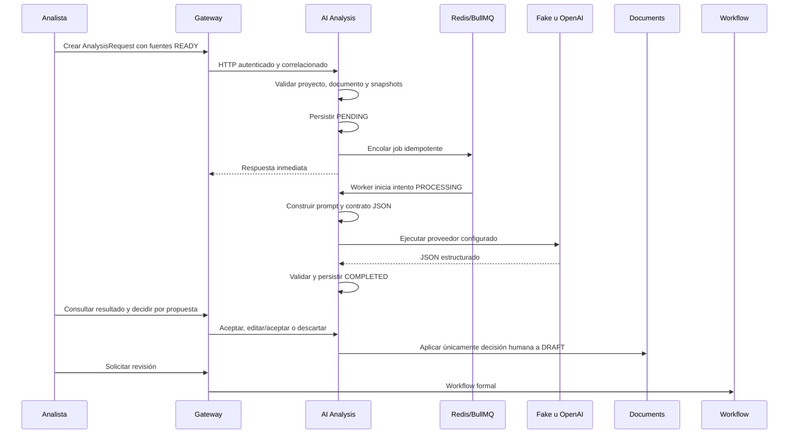

# Flujo de análisis con IA

## Principio

La IA es un asistente del analista y nunca la autoridad final. No aprueba, no
escribe directamente en Documents y no convierte inferencias en hechos.

## Requirement Analyst V1

Analiza fuentes READY, proyecto y plantilla publicada para proponer contenido
en las 13 secciones canónicas. Identifica procesos, actores, necesidades,
requerimientos, reglas, integraciones, riesgos, historias, criterios,
contradicciones, preguntas y pendientes cuando exista evidencia.

La ausencia de evidencia se representa con `[PENDIENTE POR DEFINIR]`.

## Flujo implementado

Los estados son `PENDING`, `PROCESSING`, `COMPLETED`, `FAILED` y `CANCELLED`.
Cada intento conserva proveedor, modelo, tiempos, tokens, request id,
correlación, versión de prompt y error sanitizado. Los reintentos fallidos no
se eliminan.

## Construcción del prompt

El prompt separa instrucciones del sistema, plantilla, contrato JSON, proyecto,
fuentes delimitadas como datos no confiables e instrucción final. Una fuente no
puede reemplazar las reglas de seguridad, la estructura o el contrato.

## Proveedores

`AiTextProvider` desacopla el dominio. `FakeAiProvider` es determinista para
pruebas; `OpenAiResponsesProvider` usa la Responses API y salida estructurada.
La configuración y el secreto se administran por separado.

## ERP Fit-Gap y consolidación futuros

ERP Fit-Gap y Consolidation Analyst no están activos en la V1. Una fase futura
podrá consultar únicamente conocimiento ERP importado mediante snapshots
autorizados, versionados y trazables. No se permite acceso directo a Dynamics
365 productivo, transacciones ni modificaciones; toda clasificación requerirá
revisión experta.

## Restricciones

La IA no inventa información, no resuelve contradicciones sin reportarlas, no
modifica contenido aprobado, no aplica cambios silenciosamente, no crea
referencias inexistentes y no afirma cobertura ERP sin evidencia.
