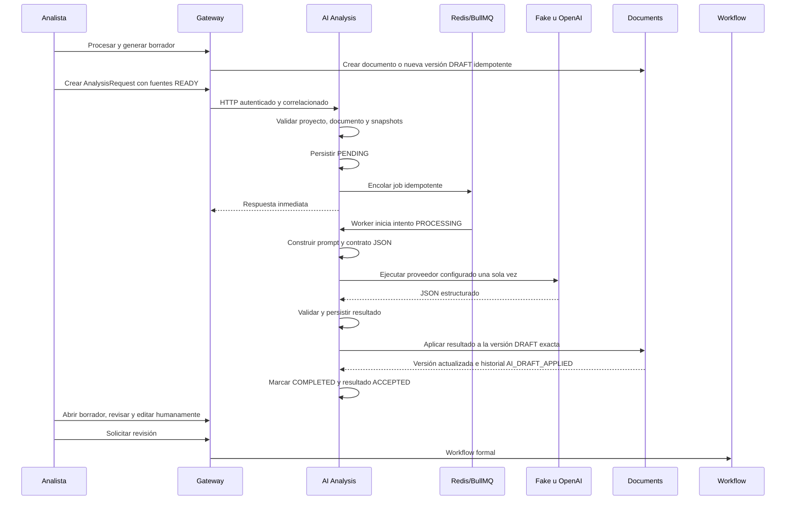

# Flujo de análisis con IA

## Principio

La IA es un asistente del analista y nunca la autoridad final. No aprueba, no
accede a la base de Documents y no convierte inferencias en hechos. El worker
puede aplicar automáticamente su salida a una versión `DRAFT` por medio de la
API interna autorizada de Documents; ese resultado continúa sujeto a revisión
humana y Workflow.

## Requirement Analyst V1

Analiza fuentes READY, proyecto y plantilla publicada para proponer contenido
en las 13 secciones canónicas. Identifica procesos, actores, necesidades,
requerimientos, reglas, integraciones, riesgos, historias, criterios,
contradicciones, preguntas y pendientes cuando exista evidencia.

La ausencia de evidencia se representa con `[PENDIENTE POR DEFINIR]`.

## Flujo implementado

Los estados son `PENDING`, `PROCESSING`, `COMPLETED`, `FAILED` y `CANCELLED`.
Cada intento conserva propósito (`INITIAL_DRAFT` o `AI_VERSION`), proveedor,
modelo, fuentes, tiempos, tokens, request id, correlación, versión de prompt y
error sanitizado. Los reintentos fallidos no se eliminan.

## Idempotencia y recuperación

La operación funcional usa una clave estable desde la creación del documento
o versión hasta `AnalysisRequest`. La combinación proyecto/clave es única en
AI Analysis y la clave de creación/versionado es única en Documents.

El resultado se persiste antes de aplicarlo. Si la llamada a Documents falla,
el job puede reintentarse usando ese resultado ya persistido: no vuelve a
invocar el proveedor. `COMPLETED` significa que la salida también quedó
aplicada a la versión `DRAFT` exacta. Una versión `IN_REVIEW` o `APPROVED` se
rechaza y nunca se sobrescribe.

## Fronteras de llamada

La IA se invoca solamente desde **Procesar y generar borrador** o **Nueva
versión con IA**. No se invoca al seleccionar fuentes, reprocesarlas
técnicamente, guardar, crear una versión manual, abrir historial, comparar,
revisar, aprobar o exportar. La exportación pertenece a Validación y opera
únicamente sobre la versión `APPROVED` exacta.

## Construcción del prompt

El prompt separa instrucciones del sistema, plantilla, contrato JSON, proyecto,
fuentes delimitadas como datos no confiables e instrucción final. Una fuente no
puede reemplazar las reglas de seguridad, la estructura o el contrato.

## Proveedores

`AiTextProvider` desacopla el dominio. `FakeAiProvider` es determinista para
pruebas; `OpenAiResponsesProvider` usa la Responses API y salida estructurada.
La configuración y el secreto se administran por separado.

## ERP Fit-Gap y consolidación futuros

ERP Fit-Gap y Consolidation Analyst no están activos en la V1. Una fase futura
podrá consultar únicamente conocimiento ERP importado mediante snapshots
autorizados, versionados y trazables. No se permite acceso directo a Dynamics
365 productivo, transacciones ni modificaciones; toda clasificación requerirá
revisión experta.

## Restricciones

La IA no inventa información, no resuelve contradicciones sin reportarlas, no
modifica contenido en revisión o aprobado, no crea referencias inexistentes y
no afirma cobertura ERP sin evidencia. Toda aplicación automática queda
identificada como generada con IA y pendiente de revisión humana.
