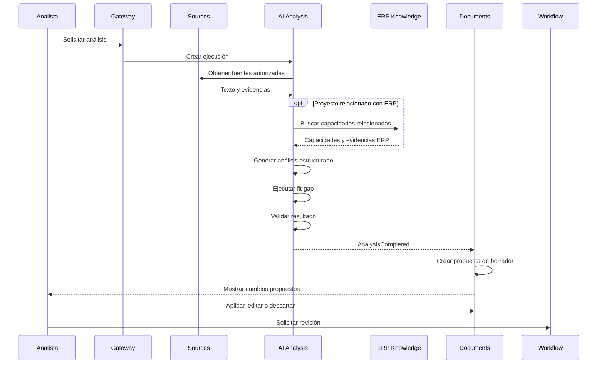

# Flujo de análisis con IA

## Principio

La IA es un asistente del analista y no la autoridad final.

## Analizadores

### Requirement Analyst

Analiza documentos, conversaciones, notas, procesos, necesidades,
restricciones, reglas y requerimientos potenciales.

### ERP Fit-Gap Analyst

Consulta conocimiento ERP aprobado para identificar capacidades,
configuraciones, cobertura parcial, extensiones, brechas y evidencias.

### Consolidation Analyst

Combina los resultados y propone usar funcionalidad existente,
configurar el ERP, reutilizar una personalización, extender Dynamics,
integrar sistemas, crear una aplicación complementaria o pedir más datos.

## Flujo

## Restricciones

La IA no inventará información, no resolverá contradicciones sin
reportarlas, no modificará contenido aprobado, no aplicará cambios
automáticamente, no creará referencias inexistentes, no afirmará que
algo existe en el ERP sin evidencia y no consultará producción.
