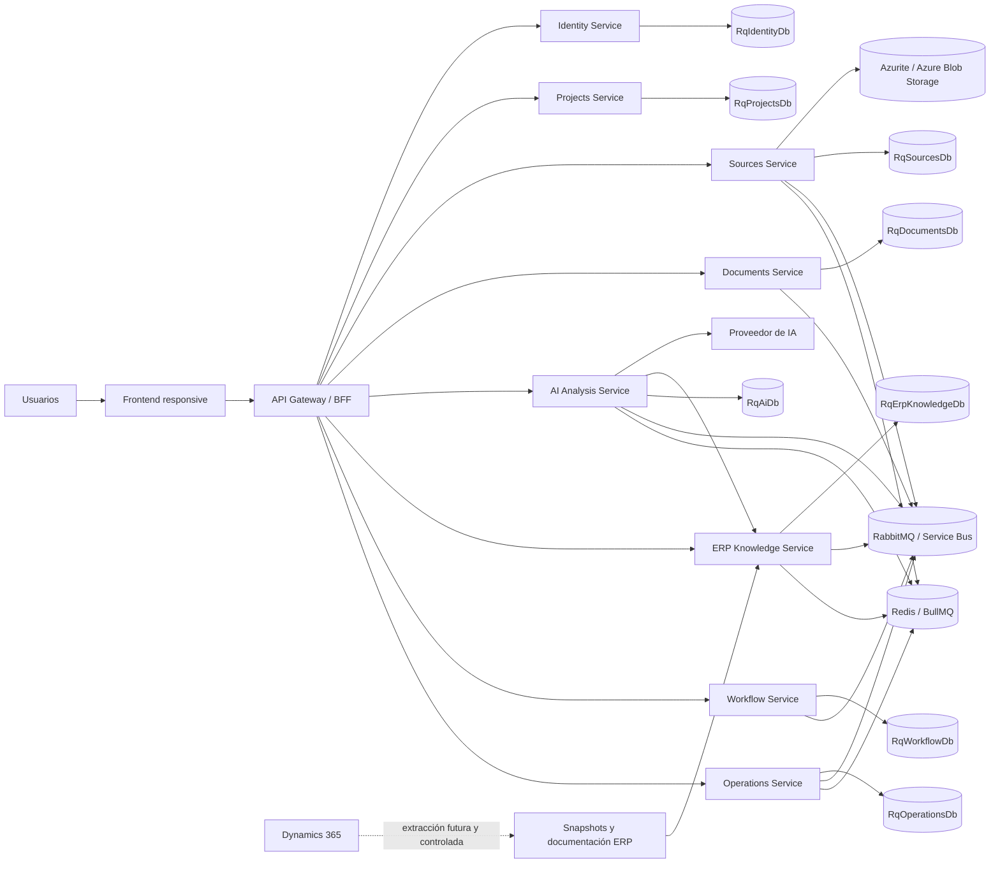

# Contexto del sistema

## Actores

- Administrador.
- Analista de procesos.
- Revisor.
- Aprobador.
- Usuario de consulta.
- Administrador de plantillas.
- Experto funcional ERP.
- Experto técnico ERP.

## Diagrama de contexto

## Regla de entrada

El frontend no conocerá las direcciones internas de los servicios.
Toda solicitud de usuario pasará por el Gateway/BFF.

## Dynamics 365

Dynamics 365 será considerado un sistema empresarial existente durante
el análisis de requerimientos.

En la primera etapa:

- No habrá integración operacional.
- No habrá acceso directo a producción.
- No se consultarán transacciones en tiempo real.
- No se ejecutarán operaciones sobre el ERP.
- No se reemplazará Dynamics como sistema maestro.

En una fase futura se podrán importar snapshots controlados de módulos,
procesos, capacidades, tablas, campos, entidades de datos, formularios,
menús, workflows, reportes, roles, extensiones, personalizaciones y
documentación funcional o técnica.
